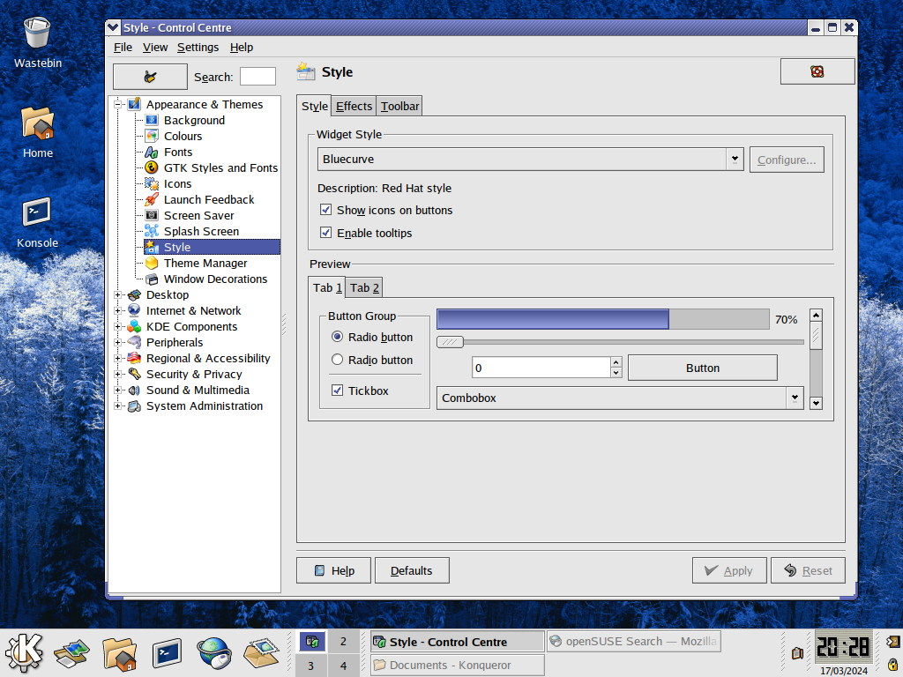

# bluecurve-opensuse
Red Hat Bluecurve theme for openSUSE KDE 3



## Includes
  * Bluecurve KDE 3 theme for openSUSE
  * Bluecurve GTK 2 engine and theme
  * Bluecurve icon set
  * Bluecurve cursors

## Requirements
You must have KDE 3 installed on openSUSE for this theme to work. For instructions on how to install KDE 3 on openSUSE [click here.](https://www.spacefun.ch/gos)

## Installation
Extract the tarball to the root directory

```bash
sudo tar -xvzf bluecurve-opensuse.tar.gz -C /
```

## Authors
- [Red Hat, Inc.](https://www.redhat.com/) (authors of Bluecurve theme)
- [@neeeow](https://github.com/neeeow) (porting Bluecurve's KDE 3 theme over to openSUSE)

## Sources
* The KDE 3 theme was compiled from source using the [redhat-artwork-5.0.8-4.fc6.src.rpm](https://archives.fedoraproject.org/pub/archive/fedora/linux/core/updates/6/SRPMS/redhat-artwork-5.0.8-4.fc6.src.rpm) Fedora Core 6 package
* The GTK 2 theme & cursors were taken from the [redhat-artwork-5.0.8-4.fc6.x86_64.rpm](https://archives.fedoraproject.org/pub/archive/fedora/linux/core/updates/6/x86_64/redhat-artwork-5.0.8-4.fc6.x86_64.rpm) Fedora Core 6 package
* The icon set was taken from [here](https://www.gnome-look.org/p/1167536) and adapted to change the K Menu icon to the KDE Classic K Menu icon
  * I chose to use this icon set instead of taking it directly from the source RPM as this icon set has been updated to reflect name changes that have occured in the past ~15+ years  
